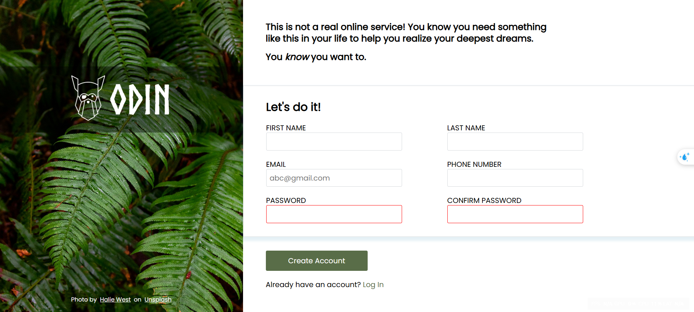

# Sign-up-Form
## Preview

Note
 Application is still under Development

## Built With
- HTML
- CSS
- JavaScript

## Tools Used
- Google
- Visual Studio Code

## Features
- Responsive for Desktop

## Outcome
- Used HTML5 semantic elements for better readability and structure
- Used CSS3 flex to manage layouts
- Used Git and Github for project management

## What I learned
- Got some experience in Form
- Learned the way to add background and some effects in CSS3
- A lot of minor things